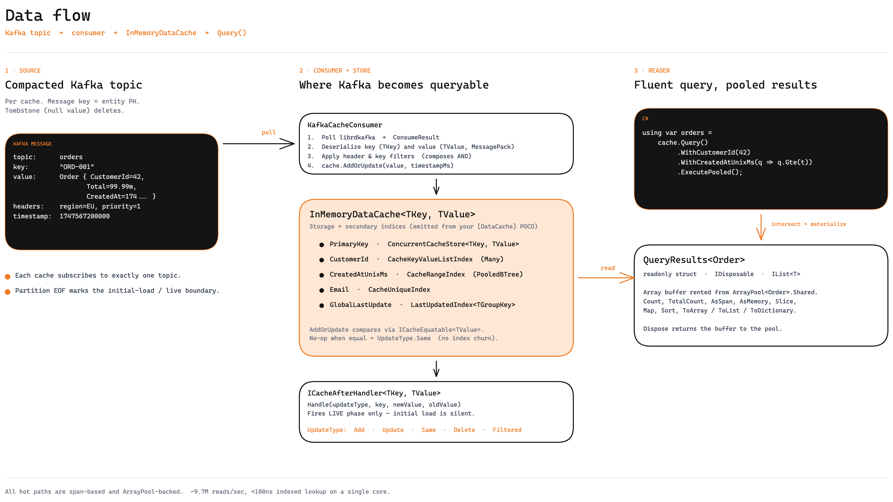

# 🏰 Prague

**The High-Performance Event Cache from Kafka's City**

Prague is a blazing-fast, compile-time safe, in-memory cache designed for event sourcing and real-time data streams. Built for .NET, it transforms raw Kafka events into lightning-fast queryable data with automatic index management and zero-reflection overhead.

[](https://www.nuget.org/packages/Prague/)
[](LICENSE)
[](https://dotnet.microsoft.com/)

```csharp
// Define your entities with relationships
[DataCache]
public partial class Product {
    [DataCacheKey]
    public int Id { get; set; }
    
    [DataCacheIndex(DataCacheIndexType.Range)]
    public long ReleaseDate { get; set; }
    
    public string Brand { get; set; }
    public bool IsPublished { get; set; }
}

[DataCache]
public partial class ProductInfo {
    [DataCacheKey] 
    public int Id { get; set; }
    
    [DataCacheForeignKey<Product>(DataCacheJoinType.OneToOne)]
    public int ProductId { get; set; }
    
    public string Warehouse { get; set; }
}

[DataCache]
public partial class Offer {
    [DataCacheKey] 
    public int Id { get; set; }
    
    [DataCacheForeignKey<Product>(DataCacheJoinType.OneToMany)]
    public int ProductId { get; set; }
    
    public decimal Price { get; set; }
}

// Query with joins - compile-time safe, zero-allocation pooled results
var results = productCache.Query()
    .WithReleaseDate(q => q.Gte(now))            // Range query
    .JoinWithProductInfo()                       // 1:1 join
    .JoinWithOffer()                             // 1:N join
    .ExecutePooled();                            // Zero-allocation

foreach (var result in results) {
    var product = result.Left;                   // Product entity
    var info = result.Right1;                    // ProductInfo (1:1)
    var offers = result.Right2;                  // List<Offer> (1:N)
}

results.Dispose();                               // Return to pool
```

## 🗺️ At a glance

Kafka topic → consumer → typed `InMemoryDataCache` with secondary indices → pooled `QueryResults<T>`. After-handlers fire on the live phase only; conditional updates (`UpdateType.Same`) suppress phantom churn.



Every `WithXxx` adds a candidate-narrowing lane. The runtime intersects them on a stackalloc bitmap and short-circuits on the first empty set — no further index walks, no allocations.


## ✨ Why Prague?

### **🚀 Extreme Performance**
- **9.7M+ reads/sec** with pooled queries (concurrent benchmark)
- **<100ns** indexed lookups
- **<50ns** conditional updates
- **Zero allocations** with pooled execution (90KB vs 4.7GB without pooling)

### **🛡️ Compile-Time Safety**
- Fluent query API with IntelliSense
- Index usage validated at compile time
- Type-safe range builders
- No reflection, no magic strings

### **🎯 Built for Event Sourcing**
- Conditional updates (only modify on change)
- Deep equality checks (structural comparison)
- **Compile-time joins** with 1:1 and 1:N relationships
- Kafka integration with change detection

### **📊 Automatic Query Optimization**
- Three index types: KeyValue (1:1), KeyValueList (1:N), Range (sorted)
- Automatic index intersection
- Query engine picks optimal execution plan
- Short-circuits on empty results

### **⚡ Modern .NET**
- Source generators (zero runtime overhead)
- Span-based APIs
- Stack allocation where possible
- SIMD-optimized operations

---

## 📦 Installation

```bash
dotnet add package Prague
dotnet add package Prague.Kafka  # For Kafka integration
```

---

## 🚀 Quick Start

### **1. Define Your Entity**

```csharp
using Prague.Core;

[DataCache(CacheClassName = "OrderCache")]
[DataCacheTopic("orders.events")]
[DataCacheSort("ByPriority", "Priority:1", "CreatedAt:-1")]
public class Order : IDataCacheItem<string, Order> {
    [DataCacheKey]
    public string OrderId { get; set; }
    
    [DataCacheIndex(DataCacheIndexType.Many)]
    public int CustomerId { get; set; }
    
    [DataCacheIndex(DataCacheIndexType.Range)]
    public long CreatedAt { get; set; }
    
    [DataCacheIndex(DataCacheIndexType.Unique)]
    public string InvoiceNumber { get; set; }
    
    public decimal Total { get; set; }
    public int Priority { get; set; }
    public OrderStatus Status { get; set; }
    
    // IDataCacheItem implementation
    public string GetKey() => OrderId;
}
```

**What happens at compile time:**
- `OrderCache` class is generated with indices
- Fluent query builder with type-safe methods
- Deep clone and equality methods
- Kafka integration (if Prague.Kafka referenced)

### **2. Use the Generated Cache**

```csharp
// Cache is generated - just instantiate it
var cache = new OrderCache();

// Add items
cache.AddOrUpdate(new Order {
    OrderId = "ORD-001",
    CustomerId = 42,
    CreatedAt = DateTimeOffset.UtcNow.ToUnixTimeMilliseconds(),
    InvoiceNumber = "INV-001",
    Total = 99.99m,
    Priority = 1,
    Status = OrderStatus.Pending
});

// Conditional update (returns false if unchanged)
bool changed = cache.AddOrUpdate(sameOrder); // false - no change detected
```

### **3. Query with Automatic Index Selection**

```csharp
// Single index
var customerOrders = cache.Query()
    .WithCustomerId(42)
    .Execute();

// Multiple index intersection (automatic optimization)
var recentHighPriority = cache.Query()
    .WithCustomerId(42)                          // CustomerID index
    .WithCreatedAt(q => q.Gte(yesterdayMs))     // Range index
    .Where(o => o.Status == OrderStatus.Pending) // Filter
    .Execute();

// With sorting and pagination
var results = cache.Query()
    .WithCustomerId(42)
    .SortByPriority()                            // Generated comparer
    .Execute(skip: 0, take: 20);

Console.WriteLine($"Found {results.TotalCount} orders, showing {results.Items.Count}");
```

### **4. Direct Index Access**

```csharp
// KeyValue index (1:1 - unique mapping)
if (cache.InvoiceNumberIndex.TryGetValue("INV-001", out var orderId)) {
    cache.TryGet(orderId, out var order);
}

// KeyValueList index (1:N - multiple values)
var orderIds = cache.CustomerIdIndex.GetValues(42);

// Range index
var recentOrders = cache.CreatedAtIndex.GetValuesBetween(
    startTime, 
    endTime
);
```

---

## 🎓 Core Concepts

### **Index Types**

Prague provides three index types, each optimized for different query patterns:

#### **1. KeyValue Index (1:1 Unique Mapping)**
```csharp
[DataCacheIndex(DataCacheIndexType.Unique)]
public string InvoiceNumber { get; set; }
```
- **Use case**: Alternate unique keys (email, invoice number, SKU)
- **Lookup**: O(1)
- **Storage**: `ConcurrentDictionary<TIndexKey, TKey>`
- **Generated**: `InvoiceNumberIndex.TryGetValue(invoice, out orderId)`

#### **2. KeyValueList Index (1:N Multi-Value)**
```csharp
[DataCacheIndex(DataCacheIndexType.Many)]
public int CustomerId { get; set; }
```
- **Use case**: Foreign keys, categories, tags
- **Lookup**: O(1) + set enumeration
- **Storage**: `ConcurrentDictionary<TIndexKey, ImmutableHashSet<TKey>>`
- **Thread-safe**: Immutable sets with structural sharing
- **Generated**: `CustomerIdIndex.GetValues(customerId)`

#### **3. Range Index (Sorted Queries)**
```csharp
[DataCacheIndex(DataCacheIndexType.Range)]
public long CreatedAt { get; set; }
```
- **Use case**: Timestamps, prices, scores, ratings
- **Lookup**: O(log n) binary search + range scan
- **Storage**: `ConcurrentSortedList<TIndexKey, TKey>`
- **Operations**: `Gte`, `Lte`, `Gt`, `Lt`, `Between`
- **Generated**: Type-safe fluent range builder

**Range query builder:**
```csharp
.WithCreatedAt(q => q.Gte(start).Lt(end))     // [start, end)
.WithCreatedAt(q => q.Gt(start).Lte(end))     // (start, end]
.WithCreatedAt(q => q.Gte(start))             // [start, ∞)
.WithCreatedAt(q => q.Lt(end))                // (-∞, end)
```

### **Joins (Foreign Key Relationships)**

Prague supports compile-time safe joins between caches with automatic index management:

#### **Defining Relationships**

```csharp
// Parent entity
[DataCache]
public partial class Product {
    [DataCacheKey]
    public int Id { get; set; }
    public string Brand { get; set; }
}

// One-to-One: Each product has exactly one ProductInfo
[DataCache]
public partial class ProductInfo {
    [DataCacheKey] 
    public int Id { get; set; }
    
    [DataCacheForeignKey<Product>(DataCacheJoinType.OneToOne)]
    public int ProductId { get; set; }
    
    public string Warehouse { get; set; }
}

// One-to-Many: Each product has multiple offers
[DataCache]
public partial class Offer {
    [DataCacheKey] 
    public int Id { get; set; }
    
    [DataCacheForeignKey<Product>(DataCacheJoinType.OneToMany)]
    public int ProductId { get; set; }
    
    public decimal Price { get; set; }
}
```

#### **Registering Joined Caches**

```csharp
var registry = new DataCacheRegistry();
var productCache = registry.GetCache<ProductCache>();
var productInfoCache = registry.GetCache<ProductInfoCache>();
var offerCache = registry.GetCache<OfferCache>();

// Register the relationship
productCache.AddJoinedCaches(productInfoCache, offerCache);
```

#### **Querying with Joins**

```csharp
// Standard execution (allocates result objects)
var results = productCache.Query()
    .WithReleaseDate(q => q.Gte(now))
    .JoinWithProductInfo()           // 1:1 join
    .JoinWithOffer()                 // 1:N join
    .Execute();

// Pooled execution (zero allocations - recommended!)
var pooledResults = productCache.Query()
    .WithReleaseDate(q => q.Gte(now))
    .JoinWithProductInfo()
    .JoinWithOffer()
    .ExecutePooled();

foreach (var result in pooledResults) {
    var product = result.Left;       // Product entity
    var info = result.Right1;        // ProductInfo (nullable for 1:1)
    var offers = result.Right2;      // ReadOnlySpan<Offer> (for 1:N)
}

pooledResults.Dispose();             // Return buffers to pool
```

#### **Join Types**

| Type | Attribute | Result Type | Use Case |
|------|-----------|-------------|----------|
| **OneToOne** | `DataCacheJoinType.OneToOne` | `TRight?` | Product → ProductInfo |
| **OneToMany** | `DataCacheJoinType.OneToMany` | `ReadOnlySpan<TRight>` | Product → Offers |

#### **Performance**

Joins are highly optimized:
- **Automatic foreign key indexing**: FK properties get indices automatically
- **Batch lookups**: All joined entities fetched in single pass
- **Pooled results**: Zero allocations with `ExecutePooled()`
- **Up to 5 joins**: Chain multiple `.JoinWith*()` calls

```
Single entity lookup:     ~2.5µs
With 1:1 join:           ~12µs
With 1:1 + 1:N joins:    ~300µs (500 products, 20 offers each)
```

### **OR Queries**

Disjunction is expressed with the two-branch `.Or(...)` clause. Each branch is a
narrowing-only sub-query; the two are unioned and intersected with the surrounding
chain. Three or more branches compose via nesting.

```csharp
// (DepartmentId = 1 OR DepartmentId = 2) AND BrandId = 5
var results = cache.Query()
    .WithBrandId(5)
    .Or(
        b => b.WithDepartmentId(1),
        b => b.WithDepartmentId(2))
    .Execute();

// Three branches — nested Or
var results = cache.Query()
    .Or(
        b => b.WithDepartmentId(1),
        b => b.Or(
            c => c.WithDepartmentId(2),
            c => c.WithDepartmentId(3)))
    .Execute();

// Cross-property: A=x OR B=y — branches narrow by different indexes
var results = cache.Query()
    .Or(
        b => b.WithDepartmentId(1),
        b => b.WithBrandId(5))
    .Execute();

// Zero-allocation TArg overload — arg shared by both branches via static lambdas
var args = (Dept1: 1L, Dept2: 2L);
var results = cache.Query()
    .Or(
        static (b, a) => b.WithDepartmentId(a.Dept1),
        static (b, a) => b.WithDepartmentId(a.Dept2),
        args)
    .Execute();

// Chained WithXxx inside a branch composes as AND (not OR)
// → (DepartmentId=1 AND BrandId=5) OR (DepartmentId=2 AND BrandId=6)
var results = cache.Query()
    .Or(
        b => b.WithDepartmentId(1).WithBrandId(5),
        b => b.WithDepartmentId(2).WithBrandId(6))
    .Execute();
```

**Semantics:**
- Two-branch arity is fixed; **3+ branches** are written by **nesting** another `Or` in a branch.
- Each branch receives a restricted builder where only `WithXxx` / `UseIndex` / nested `Or` are reachable. `Where`, `Sort`, `Join`, `Execute*` are compile-unreachable inside a branch.
- Branches compose: chained `WithXxx` within a single branch is **AND-narrowing**; across branches it is **UNION**; the result is intersected with the outer chain.
- A no-op branch (lambda that doesn't narrow) is excluded from the union.
- Reachable inside `JoinOne` filter callbacks too — the filter narrows the joined right-cache view.

**Performance:**
- One stackalloc'd bitmap per Or level backs the cross-branch union (no per-branch
  candidate-set allocations on either unpaired or paired cores).
- Cross-branch merge is SIMD-vectorized via `Vector<int>` OR/AND over the bitmap.
- Chained `WithXxx` within a branch uses mark-then-prune: O(|surviving marks|) per
  follow-up index lookup, shrinking with narrowing.
- Zero GC allocations on the happy path with `static` lambdas.

### **Query Execution Strategy**

Prague's query engine automatically optimizes your queries:

```csharp
var results = cache.Query()
    .WithDepartmentId(1)      // Index 1: Returns ~1000 candidates
    .WithBrandId(brands)      // Index 2: Intersects to ~50 candidates
    .WithReleaseDate(...)     // Index 3: Intersects to ~10 candidates
    .Where(e => e.IsPublished) // Filter: Reduces to ~5 results
    .Execute();
```

**Execution plan:**
1. First index builds candidate set (pooled `HashSet<TKey>`)
2. Subsequent indices intersect with candidates
3. **Short-circuit**: Empty intersection stops processing
4. Final filters run only on remaining candidates
5. **Zero allocations**: Uses stack allocation + pooling

**Performance:**
```
No indices:    Scan 10,000 items    → ~50µs
One index:     Scan 1,000 items     → ~5µs
Two indices:   Scan 50 items        → ~500ns
Three indices: Scan 10 items        → ~100ns ✨
```

### **Conditional Updates**

Prague detects when data hasn't changed and avoids unnecessary work:

```csharp
// First update
bool changed = cache.AddOrUpdate(order);  // true - new item

// Same data arrives (common in event streams)
bool changed = cache.AddOrUpdate(order);  // false - no change
                                           // Zero allocations!
```

**How it works:**
- Generated `CacheEquals()` performs deep structural equality
- Compares all properties recursively
- For collections: uses `SequenceEqual` or `SetEquals`
- For large structs: vectorized SIMD comparison
- **No update if equal**: Indices not touched, zero allocations

**Why this matters:**
```
Kafka stream: 100,000 events/sec
Actual changes: 10,000/sec (90% duplicates)

Without Prague:
- 100k dictionary updates
- 100k index updates
- 100k allocations
- High GC pressure

With Prague:
- 10k dictionary updates (only real changes)
- 10k index updates
- 10k allocations
- 90k fast equality checks (~25ns each)
- 90% less GC pressure ✨
```

### **Deep Cloning**

Prague generates efficient deep clone methods:

```csharp
var original = cache.Query().WithId("123").Execute().First();
var clone = original.Clone();  // Deep copy, not reference

clone.Items[0].Quantity = 99;  // Doesn't affect original
```

**Generated clone code:**
- Recursively clones nested objects
- For collections: uses optimized methods
  - `List<T>`: `ConvertAll()` (faster than LINQ)
  - `Dictionary<K,V>`: Pre-allocated capacity
  - `ImmutableHashSet<T>`: Structural sharing (cheap)
- For value types: Direct copy
- **No reflection**: Pure C# code

---

## 🔥 Advanced Features

### **Batch Operations**

Retrieve multiple items efficiently:

```csharp
var orderIds = new[] { "ORD-001", "ORD-002", "ORD-003" };

// Method 1: Zero-allocation span-based
var values = new Order[orderIds.Length];
var found = new bool[orderIds.Length];
int foundCount = cache.Cache.TryGetValues(orderIds, values, found);

for (int i = 0; i < orderIds.Length; i++) {
    if (found[i]) {
        Process(values[i]);
    }
}

// Method 2: List-based (only found items)
List<Order> orders = cache.Cache.TryGetValues(orderIds.AsSpan());
```

**Performance:** 3-5x faster than looping `TryGetValue` (single volatile read, better cache locality)

### **Custom Sorting**

Define custom sort orders via attributes:

```csharp
[DataCacheSort("ByPriority", "Priority:1", "CreatedAt:-1")]
[DataCacheSort("ByTotal", "Total:-1", "CustomerId:1")]
public class Order { ... }
```

**Generated:**
```csharp
cache.Query()
    .WithCustomerId(42)
    .SortByPriority()        // Priority ASC, CreatedAt DESC
    .Execute(skip: 0, take: 10);

cache.Query()
    .SortByTotal()           // Total DESC, CustomerId ASC
    .Execute();
```

Or use custom comparers:

```csharp
cache.Query()
    .Sort(new MyCustomComparer())
    .Execute();
```

### **Result Mapping**

Transform query results into different shapes using the `Map` method. This is useful for:
- Projecting to DTOs or view models
- Extracting specific fields
- Reducing data transfer size
- Creating API responses

#### **Basic Mapping**

```csharp
// Map to a single property
var amounts = cache.Query()
    .WithCustomerId(42)
    .Map(order => order.Total)
    .Execute();

foreach (decimal amount in amounts) {
    Console.WriteLine($"Order total: {amount}");
}

// Map to anonymous type
var summaries = cache.Query()
    .WithStatus(OrderStatus.Pending)
    .Map(order => new { order.OrderId, order.Total, order.CreatedAt })
    .Execute();

// Map to DTO
var dtos = cache.Query()
    .WithCustomerId(42)
    .Map(order => new OrderDto {
        Id = order.OrderId,
        Amount = order.Total,
        ItemCount = order.Items.Count
    })
    .Execute();
```

#### **Mapping with Sorting**

The `Map` method preserves sorting when used with `Sort` or generated sort methods:

```csharp
// Sort then map - comparer is preserved
var topAmounts = cache.Query()
    .WithCustomerId(42)
    .SortByPriority()                    // Sort orders
    .Map(order => order.Total)           // Then extract amounts
    .Execute(skip: 0, take: 10);         // Top 10

// With custom comparer
var comparer = Comparer<Order>.Create((a, b) => a.Total.CompareTo(b.Total));
var sortedTotals = cache.Query()
    .Sort(comparer)
    .Map(order => order.Total)
    .Execute();
```

#### **Mapping with Pagination**

`Map` works seamlessly with pagination, preserving `TotalCount`:

```csharp
var result = cache.Query()
    .WithCustomerId(42)
    .Map(order => new { order.OrderId, order.Total })
    .Execute(skip: 20, take: 10);

Console.WriteLine($"Showing {result.Count} of {result.TotalCount} orders");
```

#### **Performance**

- **Zero-allocation**: Mapped results use the same pooled infrastructure
- **Lazy evaluation**: Mapping function called only for returned items
- **Type-safe**: Compile-time checked transformation
- **No reflection**: Direct function call

```csharp
// Example: Extract only IDs for a large result set
var orderIds = cache.Query()
    .WithStatus(OrderStatus.Pending)
    .Map(order => order.OrderId)      // Much smaller than full Order objects
    .Execute();

// Reduces memory: 1000 orders × 1KB each = 1MB
//              vs 1000 strings × ~40 bytes = 40KB ✨
```

### **Kafka Integration**

Prague integrates seamlessly with Kafka:

```csharp
services.AddPragueKafka(options => {
    options.BootstrapServers = "localhost:9092";
})
.AddConsumer(consumer => consumer
    .AddOrderCache()                          // Generated extension
    .WithHeaderEqualsFilter("tenant", "acme") // Filter messages
)
.AddProducer(producer => producer
    .AddOrderCache("orders.output")           // Produce topic
);
```

**Consumer with Enrichment:**
```csharp
[DataCache]
public class Order {
    [DataCacheFromTimestamp]
    public long ReceivedAt { get; set; }  // Auto-populated from Kafka timestamp
    
    [DataCacheHeader("tenant-id")]
    public string TenantId { get; set; }  // Auto-populated from header
}
```

**Producer (Conditional):**
```csharp
// Only produces to Kafka if value changed
cache.AddOrUpdateAndProduce(order);  

// No-op if order unchanged (zero allocations, zero Kafka messages)
```

### **Global Last Update Index**

Track the last update timestamp per grouping key across multiple caches. This is useful for incremental synchronization, change detection, and efficient polling patterns. Multiple caches can share the same global index, allowing you to track updates across your entire domain.

#### **Step 1: Define the Global Index Class**

First, create a partial class that implements `IDataCacheGlobalLastUpdateIndex<TKey>`:

```csharp
// Tracks last update per DepartmentId across all department-related caches
public partial class DepartmentLastUpdatedIndex : IDataCacheGlobalLastUpdateIndex<int> { }

// Tracks last update per BrandId
public partial class BrandLastUpdatedIndex : IDataCacheGlobalLastUpdateIndex<long> { }

// Tracks last update per ProductId (for when the key IS the grouping key)
public partial class ProductLastUpdatedIndex : IDataCacheGlobalLastUpdateIndex<int> { }
```

The source generator will complete these partial classes with the implementation.

#### **Step 2: Apply to Cache Properties**

Use `[DataCacheGlobalLastUpdateIndex<TIndex>]` on properties to track updates:

```csharp
[DataCache]
public partial class CatalogProduct {
    [DataCacheKey] 
    public string ListingId { get; set; }
    
    public string Name { get; set; }
    
    // Track updates by DepartmentId using the default timestamp (from AddOrUpdate)
    [DataCacheGlobalLastUpdateIndex<DepartmentLastUpdatedIndex>]
    public int DepartmentId { get; set; }
    
    // Track updates by BrandId using a custom timestamp property
    [DataCacheGlobalLastUpdateIndex<BrandLastUpdatedIndex>(nameof(UpdatedAt))]
    public long BrandId { get; set; }
    
    public DateTimeOffset UpdatedAt { get; set; }
}

// Another cache sharing the same DepartmentLastUpdatedIndex
[DataCache]
public partial class CatalogMaker {
    [DataCacheKey] 
    public string MakerId { get; set; }
    
    public string MakerName { get; set; }
    
    // Updates to CatalogMaker also update the shared DepartmentLastUpdatedIndex
    [DataCacheGlobalLastUpdateIndex<DepartmentLastUpdatedIndex>]
    public int DepartmentId { get; set; }
}

// Track updates by the primary key itself (common for product catalogs)
[DataCache]
public partial class Product {
    [DataCacheKey]
    [DataCacheGlobalLastUpdateIndex<ProductLastUpdatedIndex>]
    public int ProductId { get; set; }
    
    public string Name { get; set; }
    public decimal Price { get; set; }
}
```

#### **Step 3: Use via DataCacheRegistry**

The registry automatically manages global indexes as singletons:

```csharp
var registry = new DataCacheRegistry();

// Get caches - global indexes are automatically wired up
var listingCache = registry.GetCache<CatalogProductCache>();
var makerCache = registry.GetCache<CatalogMakerCache>();
var productCache = registry.GetCache<ProductCache>();

// Access the shared global index
var departmentIndex = registry.GetGlobalIndex<DepartmentLastUpdatedIndex>();
```

#### **Querying by Last Update**

Use the global index to find entities updated after a timestamp:

```csharp
// Find all products updated after a timestamp
var recentProducts = productCache.Cache.Query()
    .UseIndex(productIndex, lastSyncTimestamp)
    .Execute();

// With max output for pagination/next sync
var products = productCache.Cache.Query()
    .UseIndex(productIndex, lastSyncTimestamp, out long maxTimestamp)
    .Execute();
// Use maxTimestamp for next incremental sync

// Query a specific time window
var windowProducts = productCache.Cache.Query()
    .UseIndex(productIndex, startTimestamp, endTimestamp)
    .Execute();
```

#### **Global Index API**

```csharp
var departmentIndex = registry.GetGlobalIndex<DepartmentLastUpdatedIndex>();

// Get min/max timestamps with their keys
if (departmentIndex.TryGetMin(out long minTimestamp, out int minDepartmentId)) {
    Console.WriteLine($"Oldest update: DepartmentId {minDepartmentId} at {minTimestamp}");
}

if (departmentIndex.TryGetMax(out long maxTimestamp, out int maxDepartmentId)) {
    Console.WriteLine($"Latest update: DepartmentId {maxDepartmentId} at {maxTimestamp}");
}

// Get timestamp only
if (departmentIndex.TryGetMin(out long oldestMs)) {
    Console.WriteLine($"Oldest timestamp: {oldestMs}");
}

// Count entities for a specific grouping key
int count = departmentIndex.GetEntitiesCount(42);  // Entities for DepartmentId=42
```

#### **UpdatedAfter Query Methods (Auto-Generated)**

When a cache has a global index on its **primary key type**, Prague generates convenient `UpdatedAfter` methods on the QueryBuilder:

```csharp
// Product has [DataCacheGlobalLastUpdateIndex] on its primary key (ProductId)
// So it gets these generated methods:

var recentProducts = productCache.Query()
    .UpdatedAfter(lastSyncTimestamp)
    .Execute();

var products = productCache.Query()
    .UpdatedAfter(lastSyncTimestamp, out long maxTimestamp)
    .Execute();

var windowProducts = productCache.Query()
    .UpdatedAfter(startTimestamp, endTimestamp)
    .Execute();

// DateTime/DateTimeOffset overloads
var products = productCache.Query()
    .UpdatedAfter(DateTimeOffset.UtcNow.AddMinutes(-5))
    .Execute();
```

#### **Multi-Cache Shared Index Example**

Multiple caches updating the same global index:

```csharp
var registry = new DataCacheRegistry();
var listingCache = registry.GetCache<CatalogProductCache>();
var makerCache = registry.GetCache<CatalogMakerCache>();
var departmentIndex = registry.GetGlobalIndex<DepartmentLastUpdatedIndex>();

// Updates from either cache affect the shared index
listingCache.AddOrUpdate(new CatalogProduct { ListingId = "E1", DepartmentId = 1 }, timestamp: 1000);
makerCache.AddOrUpdate(new CatalogMaker { MakerId = "T1", DepartmentId = 1 }, timestamp: 2000);

// The global index tracks the latest update across both caches
departmentIndex.TryGetMax(out long latestTs, out int departmentId);
// latestTs = 2000, departmentId = 1

// Query listings updated after a timestamp for a specific department
var recentListings = listingCache.Cache.Query()
    .UseIndex(departmentIndex, lastSyncTimestamp)
    .Execute();
```

#### **Use Cases**

1. **Incremental Sync**: Track what changed since last poll
   ```csharp
   long lastSync = LoadLastSyncTimestamp();
   var changes = productCache.Query()
       .UpdatedAfter(lastSync, out long newSync)
       .Execute();
   
   ProcessChanges(changes);
   SaveLastSyncTimestamp(newSync);
   ```

2. **Change Detection**: Find the most recently updated entity
   ```csharp
   if (globalIndex.TryGetMax(out long latestMs, out int latestKey)) {
       cache.TryGet(latestKey, out var latestEntity);
   }
   ```

3. **Time-Windowed Queries**: Query specific time ranges
   ```csharp
   var lastHour = DateTimeOffset.UtcNow.AddHours(-1);
   var now = DateTimeOffset.UtcNow;
   
   var recentUpdates = cache.Query()
       .UpdatedAfter(lastHour, now)
       .Execute();
   ```

### **Type-Safe Topics**

Topic names validated at compile time:

```csharp
[DataCacheTopic("orders.v1")]
public class Order { ... }

// Generated constant
OrderCache.Topic  // "orders.v1"

// With placeholders
[DataCacheTopic("orders.[v:version].[e:environment]")]
// Resolved at runtime: "orders.v2.production"
```

---

## 🏗️ Architecture

### **Generated Code Structure**

For each `[DataCache]` entity, Prague generates:

```
YourNamespace/
├── OrderCache.g.cs              // Main cache class
│   ├── Cache (InMemoryDataCache)
│   ├── CustomerIdIndex
│   ├── CreatedAtIndex
│   ├── InvoiceNumberIndex
│   └── Query() → QueryBuilder
│
├── Order.Clone.g.cs             // Deep clone
│   └── Clone() → Order
│
├── Order.Equality.g.cs          // Structural equality
│   ├── CacheEquals(Order)
│   └── CacheGetHashCode()
│
└── (If Prague.Kafka referenced)
    ├── Order.Enrichable.g.cs    // Kafka enrichment
    ├── CacheMarshall.cs         // Producer access
    └── Extensions.cs            // AddOrUpdateAndProduce
```

### **Performance Characteristics**

| Operation | Complexity | Typical Latency |
|-----------|-----------|-----------------|
| **TryGet (direct)** | O(1) | 15-25ns |
| **AddOrUpdate (new)** | O(1) + O(indices) | 40-60ns |
| **AddOrUpdate (unchanged)** | O(1) | 25-35ns |
| **Query (one index)** | O(1) + O(results) | 500ns-5µs |
| **Query (multi-index)** | O(intersect) + O(results) | 100ns-2µs |
| **Range query** | O(log n) + O(range) | 1-10µs |
| **Query with 1:1 join** | O(query) + O(n) | ~12µs |
| **Query with 1:1 + 1:N joins** | O(query) + O(n×m) | ~300µs |
| **Batch read (100 keys)** | O(n) | 1.5-3µs |

**Memory:**
- Cache overhead: ~48 bytes/item (pointers, hash)
- KeyValue index: ~32 bytes/mapping
- KeyValueList index: ~64 bytes + 32 bytes/value in set
- Range index: ~48 bytes/node

**Concurrency:**
- Lock striping: One lock per CPU core
- Read scalability: Near-linear to core count
- Write scalability: Linear up to lock count
- No lock contention on reads

---

## 🆚 Comparison

### **vs. Distributed Caches**

| Feature | **Prague** | **Redis** | **Hazelcast** | **Memcached** |
|---------|-----------|-----------|---------------|---------------|
| **Deployment** | Embedded | Client-Server | Distributed | Client-Server |
| **Latency (read)** | **<100ns** | ~500µs | ~500µs-1ms | ~300µs |
| **Latency (write)** | **<50ns** | ~600µs | ~1-2ms | ~400µs |
| **Throughput (single node)** | **5M+ ops/sec** | ~100k/sec | ~50k/sec | ~200k/sec |
| **Secondary indices** | ✅ Auto | ⚠️ Limited | ✅ Manual | ❌ |
| **Range queries** | ✅ O(log n) | ✅ Sorted sets | ✅ Predicates | ❌ |
| **Query optimization** | ✅ **Automatic** | ❌ Manual | ❌ Manual | N/A |
| **Type safety** | ✅ **Compile-time** | ❌ Runtime | ❌ Runtime | ❌ Runtime |
| **Network overhead** | **None** | High | High | High |
| **Consistency** | ✅ Immediate | ⚠️ Eventual | ⚠️ Eventual | ⚠️ None |
| **Use case** | Embedded, low-latency | Distributed, shared state | Enterprise distributed | Simple K/V |

**Verdict:** Prague is **50-100x faster** for embedded scenarios, with better developer experience.

---

### **vs. .NET In-Memory Solutions**

| Feature | **Prague** | **MemoryCache** | **LiteDB** | **EF In-Memory** | **NCache** |
|---------|-----------|-----------------|------------|------------------|-----------|
| **Secondary indices** | ✅ 3 types | ❌ | ✅ B-tree | ❌ | ⚠️ Limited |
| **Range queries** | ✅ Sorted | ❌ | ✅ SQL | ⚠️ LINQ (slow) | ⚠️ Queries |
| **Index intersection** | ✅ **Automatic** | ❌ | ⚠️ Manual | ❌ | ⚠️ Manual |
| **Conditional updates** | ✅ **Unique** | ❌ | ❌ | ❌ | ❌ |
| **Code generation** | ✅ Full | ❌ | ❌ | ⚠️ Migrations | ❌ |
| **Compile-time safety** | ✅ **Full** | ❌ | ❌ | ⚠️ Partial | ❌ |
| **Latency (indexed)** | **<1µs** | N/A | ~10-50µs | ~100µs | ~5-10µs |
| **Memory efficiency** | ✅ High | ⚠️ Overhead | ⚠️ B-tree | ⚠️ Tracking | ⚠️ Serialization |
| **Eviction** | ❌ | ✅ LRU/TTL | ❌ | ❌ | ✅ Policies |
| **Kafka integration** | ✅ Native | ❌ | ❌ | ❌ | ⚠️ Messaging |

**Verdict:** Prague is **10-100x faster** with indices, has **compile-time safety**, and **zero reflection**.

---

### **vs. Document Databases (In-Memory)**

| Feature | **Prague** | **RavenDB** | **MongoDB** | **Marten** | **Couchbase** |
|---------|-----------|-------------|-------------|------------|---------------|
| **Query language** | ✅ Fluent C# | RQL | MQL | LINQ | N1QL |
| **Index definition** | ✅ **Attributes** | ⚠️ Manual/auto | ⚠️ Manual | ⚠️ Manual | ⚠️ Manual |
| **Index updates** | ✅ **Realtime** | ⚠️ Eventually | ⚠️ Background | ⚠️ Background | ⚠️ Background |
| **Compile-time safety** | ✅ **Generated** | ❌ Runtime | ❌ Runtime | ⚠️ Partial | ❌ Runtime |
| **Read latency** | **<100ns** | ~50-500µs | ~500µs-5ms | ~100µs-1ms | ~500µs-2ms |
| **Write latency** | **<50ns** | ~100µs-1ms | ~1-10ms | ~500µs-5ms | ~1-5ms |
| **Learning curve** | **Easy** | Moderate | High | Moderate | High |
| **Persistence** | ❌ (memory) | ✅ Disk | ✅ Disk | ✅ Disk | ✅ Disk |
| **Use case** | Real-time events | Full database | Full database | .NET docs | Distributed |

**Verdict:** Prague is **100-1000x faster** for in-memory, with superior DX (compile-time safety, generated code).

---

### **What Makes Prague Unique**

**Nobody else has ALL of these:**

1. ✅ **Compile-Time Query Safety** - IntelliSense-driven queries, validated at build time
2. ✅ **Automatic Index Intersection** - Query engine picks optimal strategy
3. ✅ **Zero-Allocation Queries** - Stack-allocated bitmaps, pooled sets (90KB vs 4.7GB)
4. ✅ **Compile-Time Joins** - Type-safe 1:1 and 1:N relationships with generated methods
5. ✅ **Conditional Updates** - Built-in change detection, returns boolean
6. ✅ **Generated Deep Clone/Equality** - No reflection, recursive, vectorized
7. ✅ **Kafka-Native** - Static dispatch, conditional produce, enrichment
8. ✅ **Type-Safe Range Queries** - Fluent API prevents invalid ranges

**Prague is essentially:**
> **"SQLite for Real-Time Event Sourcing"**
> 
> Embedded, high-performance, compile-time safe, event-first

---

## 📚 Examples

### **Real-Time Product Catalog**

```csharp
// Product entity - the root
[DataCache]
public partial class Product {
    [DataCacheKey]
    public int Id { get; set; }
    
    [DataCacheIndex(DataCacheIndexType.Range)]
    public long ReleaseDate { get; set; }
    
    public string Manufacturer { get; set; }
    public string Supplier { get; set; }
    public bool IsPublished { get; set; }
}

// Product info - 1:1 relationship
[DataCache]
public partial class ProductInfo {
    [DataCacheKey] 
    public int Id { get; set; }
    
    [DataCacheForeignKey<Product>(DataCacheJoinType.OneToOne)]
    public int ProductId { get; set; }
    
    public string Warehouse { get; set; }
    public string Inspector { get; set; }
    public int StockLevel { get; set; }
}

// Offers - 1:N relationship  
[DataCache]
public partial class Offer {
    [DataCacheKey] 
    public int Id { get; set; }
    
    [DataCacheForeignKey<Product>(DataCacheJoinType.OneToMany)]
    public int ProductId { get; set; }
    
    public string OfferType { get; set; }
    public decimal RetailPrice { get; set; }
    public decimal SalePrice { get; set; }
    public decimal WholesalePrice { get; set; }
}

// Setup
var registry = new DataCacheRegistry();
var productCache = registry.GetCache<ProductCache>();
var productInfoCache = registry.GetCache<ProductInfoCache>();
var offerCache = registry.GetCache<OfferCache>();
productCache.AddJoinedCaches(productInfoCache, offerCache);

// Query with joins - zero allocations with pooled execution
var now = DateTimeOffset.UtcNow.ToUnixTimeMilliseconds();

var results = productCache.Query()
    .WithReleaseDate(q => q.Gte(now))         // Products releasing now or later
    .Where(p => p.IsPublished)                // Published only
    .JoinWithProductInfo()                    // Include warehouse info
    .JoinWithOffer()                          // Include all offers
    .ExecutePooled();

foreach (var result in results) {
    var product = result.Left;
    var info = result.Right1;                 // ProductInfo (1:1)
    var offers = result.Right2;               // ReadOnlySpan<Offer> (1:N)
    
    Console.WriteLine($"{product.Manufacturer} - {product.Supplier}");
    Console.WriteLine($"  Warehouse: {info?.Warehouse}");
    Console.WriteLine($"  Offers: {offers.Length}");
}

results.Dispose();  // Return to pool
```

### **E-Commerce Order Processing**

```csharp
[DataCache]
[DataCacheTopic("orders.events.[e:env]")]
public class Order : IDataCacheItem<string, Order> {
    [DataCacheKey]
    public string OrderId { get; set; }
    
    [DataCacheIndex(DataCacheIndexType.Many)]
    public int CustomerId { get; set; }
    
    [DataCacheIndex(DataCacheIndexType.Many)]
    public OrderStatus Status { get; set; }
    
    [DataCacheIndex(DataCacheIndexType.Range)]
    public long CreatedAt { get; set; }
    
    [DataCacheIndex(DataCacheIndexType.Range)]
    public decimal Total { get; set; }
    
    [DataCacheFromTimestamp]
    public long ProcessedAt { get; set; }
    
    public List<OrderItem> Items { get; set; }
    
    public string GetKey() => OrderId;
}

// Get pending high-value orders for VIP customers
var vipCustomers = new[] { 42, 123, 456 };

var highValueOrders = cache.Query()
    .WithCustomerId(vipCustomers)
    .WithStatus(OrderStatus.Pending)
    .WithTotal(q => q.Gte(1000m))  // Over $1000
    .Execute();
```

### **IoT Sensor Data**

```csharp
[DataCache]
public class SensorReading : IDataCacheItem<string, SensorReading> {
    [DataCacheKey]
    public string ReadingId { get; set; }
    
    [DataCacheIndex(DataCacheIndexType.Many)]
    public string DeviceId { get; set; }
    
    [DataCacheIndex(DataCacheIndexType.Many)]
    public string SensorType { get; set; }
    
    [DataCacheIndex(DataCacheIndexType.Range)]
    public long Timestamp { get; set; }
    
    [DataCacheIndex(DataCacheIndexType.Range)]
    public double Value { get; set; }
    
    public string GetKey() => ReadingId;
}

// Find temperature anomalies in last 5 minutes
var fiveMinAgo = DateTimeOffset.UtcNow.AddMinutes(-5).ToUnixTimeMilliseconds();

var anomalies = cache.Query()
    .WithDeviceId("SENSOR-001")
    .WithSensorType("temperature")
    .WithTimestamp(q => q.Gte(fiveMinAgo))
    .WithValue(q => q.Gt(80.0).Or.Lt(10.0))  // Too hot or too cold
    .Execute();
```

---

## 🛠️ Configuration

### **Kafka Consumer**

```csharp
services.AddPragueKafka(options => {
    options.BootstrapServers = "kafka:9092";
    options.GroupId = "my-service";
    options.AutoOffsetReset = AutoOffsetReset.Earliest;
})
.AddConsumer(consumer => consumer
    .AddProductCache()
    .WithHeaderEqualsFilter("tenant", "acme")
    .WithHeaderEqualsFilter("version", 1, 2)  // v1 or v2
    
    .AddOrderCache("orders.input")
    .WithHeaderExistsFilter("correlation-id")
);
```

### **Kafka Producer**

```csharp
services.AddPragueKafka(options => {
    options.BootstrapServers = "kafka:9092";
})
.AddProducer(producer => producer
    .AddOrderCache("orders.output")
);
```

### **Topic Placeholders**

```csharp
[DataCacheTopic("events.[v:apiVersion].[e:environment]")]

// Resolves to: "events.v2.production"
services.AddPragueKafka(options => {
    options.Variables["apiVersion"] = "v2";
    options.EnvironmentVariables["environment"] = "production";
});
```

---

## 🩺 Health Checks

Prague ships split **liveness** and **readiness** `IHealthCheck` implementations
ready to plug into `Microsoft.Extensions.Diagnostics.HealthChecks`. The healthy
path is **zero allocation** — safe to call at any probe rate.

### **1. Register**

```csharp
services
    .AddKafkaCaches(/* your existing config */);

services
    .AddHealthChecks()
    .AddPragueKafkaLiveness()    // default name: "prague-kafka-live",  failure: Unhealthy
    .AddPragueKafkaReadiness();  // default name: "prague-kafka-ready", failure: Degraded
```

That's it — defaults work out of the box: 3 s poll-loop heartbeat timeout,
5 s per-handler processing watchdog, `MinBrokersUp = 1`,
`StatisticsEnabled = true`.

### **2. Expose endpoints (k8s-style)**

Tag the checks so each endpoint runs only its own probe:

```csharp
services.AddHealthChecks()
    .AddPragueKafkaLiveness (tags: new[] { "live"  })
    .AddPragueKafkaReadiness(tags: new[] { "ready" });

app.MapHealthChecks("/health/live",  new HealthCheckOptions {
    Predicate = r => r.Tags.Contains("live")
});
app.MapHealthChecks("/health/ready", new HealthCheckOptions {
    Predicate = r => r.Tags.Contains("ready"),
    ResultStatusCodes = {
        [HealthStatus.Healthy]   = StatusCodes.Status200OK,
        [HealthStatus.Degraded]  = StatusCodes.Status503ServiceUnavailable,
        [HealthStatus.Unhealthy] = StatusCodes.Status503ServiceUnavailable,
    }
});
```

> ⚠️ The default `MapHealthChecks` mapping returns **200** for `Degraded` —
> if you want k8s to pull a Degraded pod from the LB, map `Degraded → 503`
> as shown above.

```yaml
livenessProbe:
  httpGet: { path: /health/live,  port: http }
  periodSeconds: 10
  failureThreshold: 3      # ~30 s before pod restart
readinessProbe:
  httpGet: { path: /health/ready, port: http }
  periodSeconds: 5
  failureThreshold: 2      # ~10 s before pod is pulled from LB
```

### **3. What each check covers**

**Liveness** (any failure ⇒ `Unhealthy`):

| Predicate | Catches |
|---|---|
| `FatalLatched` | Fatal Kafka error or app-fatal error code; consumer is unsafe |
| `PollLoopStalled` | Outer poll loop hasn't returned within `PollLoopHeartbeatTimeout` (deadlock, wedged librdkafka) |
| `HandlerLoopFaulted` | A per-cache `ChannelLoop` has terminated with an exception |
| `HandlerProcessingTimeout` | A single message has been in-flight in a handler longer than `HandlerProcessingTimeout` |

**Readiness** (= liveness AND, on failure ⇒ `Degraded`):

| Predicate | Catches |
|---|---|
| `InitialLoadIncomplete` | At least one cache hasn't finished its initial load — queries would see partial data |
| `NoPartitionAssigned` | A cache's topic has zero partitions assigned (rebalance stuck, ACL revoked, missing topic) |
| `BrokersDown` | Fewer than `MinBrokersUp` brokers in `UP` state |
| `PartitionsLost` | Last rebalance event was a partitions-lost (session timeout / broker death) and re-assignment hasn't happened |

When something fails, `HealthCheckResult.Data` includes
`<consumer>.failures = [...]` and `<consumer>.caches = [...]` so logs and
default JSON output show *which* consumer/cache is at fault.

### **4. Configuration overrides**

```csharp
services.Configure<KafkaCachesHealthOptions>(o => {
    o.PollLoopHeartbeatTimeout = TimeSpan.FromSeconds(3);
    o.HandlerProcessingTimeout = TimeSpan.FromSeconds(5);
    o.MinBrokersUp             = 1;
});

// or from configuration
services.Configure<KafkaCachesHealthOptions>(configuration.GetSection("KafkaHealth"));
```

> ℹ️ **`MinBrokersUp` requires `KafkaCachesGlobalOptions.StatisticsEnabled = true`** (the default).
> If you explicitly disable statistics, librdkafka stops reporting broker
> state, so `BrokerUpCount` stays at 0 — set `MinBrokersUp = 0` in that case
> to disable the predicate.

---

## 📊 OpenTelemetry Metrics

Prague ships an opt-in OpenTelemetry metric surface sourced entirely from the
statistics already collected by the consumer/cache subsystem. Every instrument
is **observable** (callback-based) and runs on the exporter's scrape — **zero
allocations per scrape after warm-up**, **zero hot-path cost**.

### **1. Register**

Add the OTel package and call the extension inside your `MeterProviderBuilder`:

```csharp
services
    .AddKafkaCaches(/* your existing config */);

services
    .AddOpenTelemetry()
    .WithMetrics(m => m
        .AddPragueKafkaInstrumentation()       // → "prague.kafka.*"
        .AddPrometheusExporter());
```

The default prefix is empty, so metric names are `prague.kafka.*`. Pass a
prefix to namespace the metrics differently:

```csharp
m.AddPragueKafkaInstrumentation();             // → "prague.kafka.*"
m.AddPragueKafkaInstrumentation("acme.");      // → "acme.prague.kafka.*"
```

### **2. Metrics emitted**

| Metric | Kind | Unit | Tags |
|---|---|---|---|
| `prague.kafka.consumer.partitions.assigned` | UpDownCounter | `{partition}` | `consumer` |
| `prague.kafka.consumer.broker.rtt.p99` | Gauge | `ms` | `consumer` |
| `prague.kafka.consumer.health` | Gauge | `0`/`1` | `consumer` |
| `prague.kafka.cache.size` | UpDownCounter | `{item}` | `consumer`, `cache` |
| `prague.kafka.cache.messages.received` | Counter | `{message}` | `consumer`, `cache` |
| `prague.kafka.cache.health` | Gauge | `0`/`1` | `consumer`, `cache` |
| `prague.kafka.cache.index.size` | UpDownCounter | `{item}` | `consumer`, `cache`, `index`, `kind=keys\|values` |

- `broker.rtt.p99` is **max-of-p99 across brokers** (worst-broker tail).
- `cache.size` is the **live** row count, not the snapshot.
- `messages.received` is cumulative (from librdkafka per-topic `rxmsgs`).
- `cache.index.size` emits one measurement per index per `kind` — `keys` is the unique-key count, `values` is the total value count.

### **3. Health semantics**

Both `health` gauges follow Prometheus `up`-style: **`1` = healthy, `0` = unhealthy**. No reason tag — the metric is a binary alarm, and the `/health` endpoint's `Data` carries the failure reasons. Same predicates as the liveness/readiness checks (single source of truth via `KafkaCachesHealthPredicates`).

```promql
# Alert if any consumer goes unhealthy
min by (consumer) (prague_kafka_consumer_health) == 0

# Alert if any specific cache goes unhealthy
min by (consumer, cache) (prague_kafka_cache_health) == 0
```

### **4. Performance**

Observable callbacks read existing volatile fields on the stats struct. No hot-path instrumentation. After warm-up, a full scrape (all 7 instruments × N consumers × M caches × I indexes) is verified to allocate **exactly 0 bytes**:

- Tag arrays cached per dimension combo via a lock-free `QuickLookupCache`.
- `Measurement<T>` constructed via the no-tags ctor + `[UnsafeAccessor]` field swap — no internal tag-array clone.
- Each instrument's callback returns a `ReusableMeasurementSource<T>` that implements both `IEnumerable<T>` and `IEnumerator<T>` — `GetEnumerator()` returns `this`, so the SDK's `foreach` doesn't allocate an enumerator either.

---

## 🧪 Testing

Prague is designed for testability:

```csharp
// In-memory cache for unit tests
var cache = new OrderCache();

cache.AddOrUpdate(new Order { OrderId = "TEST-001", ... });

var results = cache.Query()
    .WithCustomerId(42)
    .Execute();

Assert.AreEqual(1, results.Count);
```

No mocking needed - it's an in-memory cache!

---

## 🤝 Contributing

Contributions are welcome! Please see [CONTRIBUTING.md](CONTRIBUTING.md) for guidelines.

---

## 📄 License

Prague is licensed under the [MIT License](LICENSE).

---

## 🙏 Acknowledgments

Named after Prague, the birthplace of Franz Kafka, whose works inspired the Kafka streaming platform that Prague integrates with.

Built with modern .NET features:
- Source Generators (Roslyn)
- Span&lt;T&gt; and Memory&lt;T&gt;
- ImmutableCollections
- System.Threading.Lock

---

## 📖 Documentation

- [Getting Started Guide](docs/getting-started.md)
- [Index Types Explained](docs/indices.md)
- [Query Optimization](docs/query-optimization.md)
- [Kafka Integration](docs/kafka.md)
- [Performance Tuning](docs/performance.md)
- [API Reference](docs/api-reference.md)

---

## 💬 Community

- [GitHub Discussions](https://github.com/yourorg/prague/discussions)
- [Issue Tracker](https://github.com/yourorg/prague/issues)

---

**Built for Kafka, Fast as Thought** 🏰
