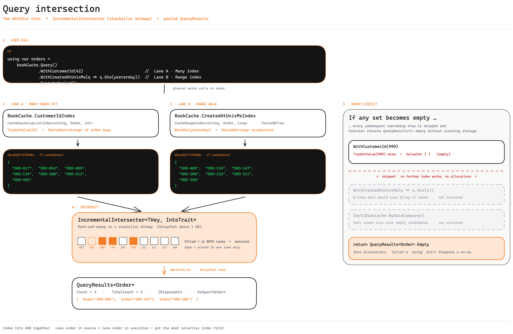

# Query Engine

The fluent query API is the single read surface on a Prague cache. It is shaped by the indices you declared and executed against the in-memory storage with zero reflection.



## Anatomy of a query

```csharp
using var results = orderCache.Query()
    .WithCustomerId(42)                              // Many index hit
    .WithCreatedAtUnixMs(q => q.Gte(yesterdayMs))    // Range index hit
    .ExecutePooled(skip: 0, take: 100);              // pooled materialization
```

Three phases run end-to-end:

1. **Planning** — each `WithXxx`/`UseIndex` call appends a candidate-narrowing step to a compile-time-typed builder. The C# type of the builder grows with every chained call; no runtime plan tree exists.
2. **Intersection** — at `Execute*`, the planner walks the steps in declaration order and intersects the candidate sets. Index hits feed an `IncrementalIntersecter` whose internal bitmap is `stackalloc`'d when small.
3. **Materialization** — surviving keys are dereferenced into the result array (pooled or allocated).

## Execute variants

Every query terminates in one of four methods on the combined builder:

| Method | Allocates | Clones | Use case |
| --- | --- | --- | --- |
| `Execute()` | new `T[]` | no | One-off use; convenient for tests. |
| `ExecuteCloned()` | new `T[]` | yes | Caller mutates and we don't want the cache copy mutated. |
| `ExecutePooled()` | `ArrayPool` rent | no | **Default on hot paths.** Caller must `using`. |
| `ExecutePooledCloned()` | `ArrayPool` rent | yes | Pooled buffer + safe-to-mutate elements. |

All four accept `skip` and `take` integer arguments for offset pagination.

The return type is `QueryResults<T>`:

```csharp
public readonly struct QueryResults<T> :
    IList<T>, IReadOnlyList<T>, IDisposable, IQueryResults
{
    int Count { get; }
    int TotalCount { get; }                // pre-pagination count, useful for "X of Y" UIs
    Span<T> AsSpan();
    Memory<T> AsMemory();
    QueryResults<T> Slice(int index, int count);
    QueryResults<TMapped> Map<TMapped>(Func<T, TMapped>);
    void Sort<TComparer>(TComparer comparer) where TComparer : IComparer<T>;
    T[] ToArray();
    T[] ToPooledArray();
    List<T> ToList();
    HashSet<T> ToHashSet();
    Dictionary<TKey, T> ToDictionary<TKey>(Func<T, TKey>);
    void Dispose();
}
```

`QueryResults<T>` has an implicit conversion to `ReadOnlySpan<T>`. Disposing returns the pooled buffer to `ArrayPool.Shared`; the struct is safe to dispose twice but the buffer must not outlive disposal.

## Intersection semantics

- Index hits intersect with logical AND.
- A `Many` index with multiple values (span or list overload) is treated as **OR** internally, then intersected with siblings as a single set.
- Empty candidate sets short-circuit: subsequent narrowing steps are skipped, and `Execute*` returns `QueryResults<T>.Empty` without scanning the storage.
- Range indices contribute via B-Tree walks bounded by the operator (`Gte`, `Lt`, etc.); the walked node range feeds the same intersecter.

There is **no** runtime cost-based optimizer — your call order is the order. Place the most selective index first to keep intermediate sets small.

## UseIndex — manual planning

When you have a reference to a generated `CacheUniqueIndex<...>` / `CacheKeyValueListIndex<...>` (often because you want to compose with a foreign-key selector or feed values from another cache), `UseIndex` lets you narrow the candidate set without going through `WithProperty`:

```csharp
using var spans = books.Query()
    .UseIndex(books.GenreIdIndex, requestedGenreIds.AsSpan())
    .ExecutePooled();
```

`UseIndex` accepts:

- `index, TIndexKey value` — single equality.
- `index, List<TIndexKey> values` — multi-value OR.
- `index, ReadOnlySpan<TIndexKey> values` — same, span variant.
- `index, ReadOnlySpan<TOtherValue> values, Func<TOtherValue, TIndexKey> keySelector` — span + key transform for cross-key-type joins.

## Or — disjunction

Two-branch `.Or(b1, b2)` injects a disjunction step into the candidate-narrowing
pipeline. Both branches are evaluated, their results unioned, and the union is
intersected with the surrounding chain.

```csharp
using var results = orderCache.Query()
    .WithStatus(OrderStatus.Open)
    .Or(
        b => b.WithCustomerId(42),
        b => b.WithCustomerId(43))
    .ExecutePooled();
```

The above is equivalent to `Status = Open AND (CustomerId = 42 OR CustomerId = 43)`.

### Semantics

- **Fixed two-branch arity.** Three or more disjuncts are expressed by nesting an
  `Or` inside a branch:

  ```csharp
  .Or(
      b => b.WithCustomerId(42),
      b => b.Or(
          c => c.WithCustomerId(43),
          c => c.WithCustomerId(44)))
  ```

- **Restricted branch surface.** Each branch lambda receives a builder where only
  `WithXxx` / `UseIndex` / nested `Or` are reachable. `Where`, `Sort`, `Join`,
  and `Execute*` are compile-unreachable — enforced by a dedicated discriminator
  type (`NarrowOnlyQuery<TCache>`).

- **Within a branch, chained `WithXxx` composes as AND.** Each successive call
  prunes the marks produced by the previous one.

  ```csharp
  // (Status = Open) AND ((Country = US AND Genre = Mystery) OR (Country = GB AND Genre = Romance))
  .Or(
      b => b.WithCountry("US").WithGenre("Mystery"),
      b => b.WithCountry("GB").WithGenre("Romance"))
  ```

- **Across branches, the union semantic.** Marks from b1 and b2 are OR'd in a
  shared bitmap; the result is intersected with the outer narrowing.

- **No-op branch excluded.** A branch lambda that doesn't call any `WithXxx`
  contributes nothing to the union — useful for conditional inclusion.

- **Reachable inside `JoinOne` filters.** The right-cache filter callback in a
  `JoinOne(..., filter)` is itself a narrow-capable builder, so `q.Or(...)`
  inside the filter narrows which right-cache entries attach to each left row.

### Zero-allocation `TArg` overload

For closure-free static-lambda use, the `TArg` overload threads a single arg to
both branches:

```csharp
var args = (Min: 100, Max: 200);
using var results = orderCache.Query()
    .Or(
        static (b, a) => b.WithTotal(a.Min),
        static (b, a) => b.WithTotal(a.Max),
        args)
    .ExecutePooled();
```

### Performance

- One stackalloc'd `Span<int>` bitmap per `Or` level (typically ~1 KB, falls back
  to `ArrayPool` only for huge candidate sets). No per-branch `ValueSet<TKey>`
  allocation.
- Cross-branch merge uses `BitHelper.Union` — SIMD `Vector<int>` OR; ~32 keys/cycle
  on AVX2, 64 on AVX-512.
- Chained `WithXxx` within a branch uses **mark-then-prune**: the first call marks
  bits, each subsequent call walks the current marks and unmarks slots whose key
  isn't in the new index's result. Work scales with `|surviving marks|`, not with
  the index's lookup result — narrowing chains get faster, not slower.
- Zero GC allocations with `static` lambdas (or with the `TArg` overload when state
  must flow through).

## Sort

`Sort` wraps the builder in `SortedQuery<TDiscriminator>` and composes with downstream joins:

```csharp
using var page = orderCache.Query()
    .WithCustomerId(42)
    .Sort(OrderCache.ByDateComparer)
    .ExecutePooled(skip: 0, take: 25);
```

`Sort` takes any `IComparer<T>`. The generator emits one per `[DataCacheSort]` declaration (see [Index Types](index-types.md)). Sort runs after intersection on the candidate set, not on the whole cache.

## Counting

`Count(...)` returns the matching count without materializing the values:

```csharp
var n = orderCache.Query()
    .WithCustomerId(42)
    .Count();
```

It uses the same intersection plan but skips the result-array allocation.

## String queries

Each generated cache also exposes `IQueryParser<TValue> QueryParser { get; }` for string-driven queries — useful for read APIs:

```csharp
using var results = orderCache.QueryParser.StringQueryPooled("customerId=42&total>100");
```

The query language is simple equality + range over the queryable fields enumerated by `QueryParser.QueryableFields`.

## Next

- [Conditional Updates](conditional-updates.md) — how writes interact with deep equality.
- [Joins](joins.md) — extending a query with another cache's view.
